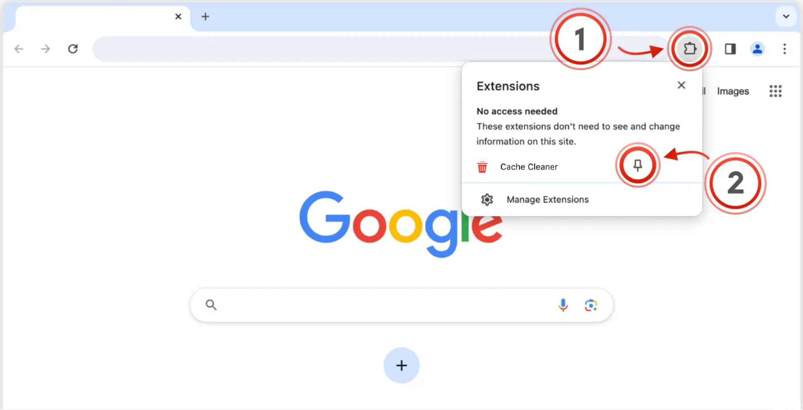

<b>Cache Cleaner Installed</b>

  Click the puzzle piece (1) in the top right of your browser. Then, click  
  the little pin (2) next to the extension:

  

  Open the extension (3) on any page to start using Cache Cleaner:

  

